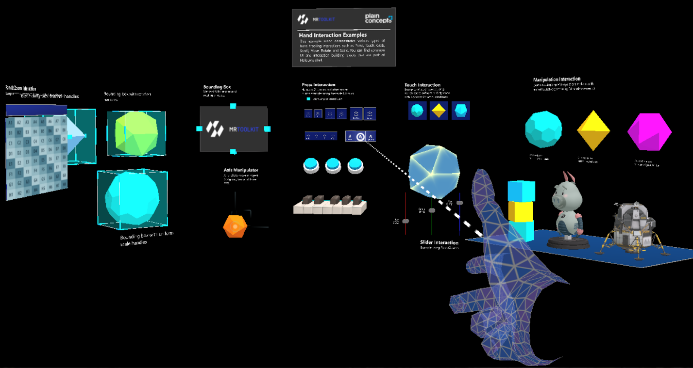

# What is WaveEngine.MRTK
WaveEngine.MRTK is a project that provides a set of components and features used to accelerate cross-platform XR application development in Wave Engine. 

WaveEngine.MRTK provides a set of **basic building blocks for Wave Engine development on XR platforms** such as
* Microsoft HoloLens 2
* Windows Mixed Reality headsets
* OpenVR headsets (HTC Vive / Oculus Rift)

WaveEngine.MRTK is heavily based on Microsoft's [Mixed Reality Toolkit for Unity](https://github.com/microsoft/MixedRealityToolkit-Unity).  

# Required software
 [Windows SDK](https://developer.microsoft.com/windows/downloads/windows-10-sdk) |  [Wave Engine](https://waveengine.net/Downloads) |  [Visual Studio 2019](http://dev.windows.com/downloads) |  [Emulators (optional)](https://docs.microsoft.com/windows/mixed-reality/using-the-hololens-emulator)|
| :--- | :--- | :--- | :--- |
| You need the Windows 10 SDK. To run apps for immersive headsets, you need the Windows 10 Fall Creators Update | Wave Engine provides support for building XR projects in Windows 10 | Visual Studio is used for code editing, deploying and building application packages | The emulators allow you to test your app without the device in a simulated environment |
 

# UI and interaction building blocks
These components can be added to your scene and customized using the Wave Engine Editor.
||||
| :--- | :--- | :--- |
|  [Button](Documentation/README_Button.md) |  Bounding Box |  [Manipulation Handler](Documentation/README_ManipulationHandler.md) |
| A button control which supports various input methods, including HoloLens 2's articulated hand | Standard UI for manipulating objects in 3D space | Component for manipulating objects with one or two hands |
|  [Slider](Documentation/README_Slider.md) |  Hand Menu |  Fingertip Visualization |
| Slider for adjusting values supporting direct hand tracking interaction | Hand-locked UI for quick access, using the Hand Constraint Solver | Visual affordance on the fingertip which improves the confidence for the interaction |
 

# Example scene
Check out WaveEngine.MRTK's various types of interactions and UI controls in our sample scene, which can be found in the Releases section.

## Videos

