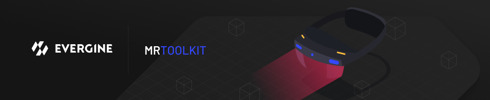

# Evergine MRTK Package

## What is Evergine.MRTK

Evergine.MRTK is an Evergine package that provides a set of components and features used to accelerate cross-platform XR application development in Evergine.

Evergine.MRTK provides a set of **basic building blocks for Evergine development on XR platforms** such as

- Microsoft HoloLens 2
- Windows Mixed Reality headsets
- OpenVR headsets (HTC Vive / Oculus Rift)

Evergine.MRTK is heavily based on Microsoft's [Mixed Reality Toolkit for Unity](https://github.com/microsoft/MixedRealityToolkit-Unity).  

## Required software

|  [Evergine](www.evergine.com) |  [Visual Studio 2019/2022](http://dev.windows.com/downloads) |  [Windows SDK](https://developer.microsoft.com/windows/downloads/windows-10-sdk) |  [Emulators (optional)](https://docs.microsoft.com/windows/mixed-reality/using-the-hololens-emulator) |
| :------------------------------------------------------------------------------------------------------------------------------------------- | :------------------------------------------------------------------------------------------------------------------------------------------------------------------- | :------------------------------------------------------------------------------------------------------------------------------------------------------------------------------------------------------------------- | :------------------------------------------------------------------------------------------------------------------------------------------------------------------------------------------------------------------------------------------------------------ |
| Evergine provides support for building XR projects in Windows 10                                                                             | Visual Studio is used for code editing, deploying and building application packages                                                                                  | You need the Windows 10 SDK. To run apps for immersive headsets, you need the Windows 10 Fall Creators Update                                                                                                        | The emulators allow you to test your app without the device in a simulated environment                                                                                                                                                                        |

## UI and interaction building blocks

These components can be added to your scene and customized using the Evergine Editor.
||||
| :--- | :--- | :--- |
|  [Button](Documentation/README_Button.md) |  [Bounding Box](Documentation/README_BoundingBox.md) |  [Manipulation Handler](Documentation/README_ManipulationHandler.md) |
| A button control which supports various input methods, including HoloLens 2's articulated hand | Standard UI for manipulating objects in 3D space | Component for manipulating objects with one or two hands |
|  [Slider](Documentation/README_Slider.md) |  Hand Menu |  [Fingertip Visualization](Documentation/README_FingerTip.md) |
| Slider for adjusting values supporting direct hand tracking interaction | Hand-locked UI for quick access, using the Hand Constraint Solver | Visual affordance on the fingertip which improves the confidence for the interaction |
|  [Slate](Documentation/README_Slate.md) |  Pointers |  [Voice Command / Dictation](Documentation/README_Voice.md) |
| 2D style plane which supports scrolling with articulated hand input | Learn about various types of pointers | Scripts and examples for integrating speech input|

## Example scene

Check out Evergine.MRTK's various types of interactions and UI controls in our sample scene, which can be found in the Releases section.

Video: https://www.youtube.com/watch?v=KbhLifObJNA

